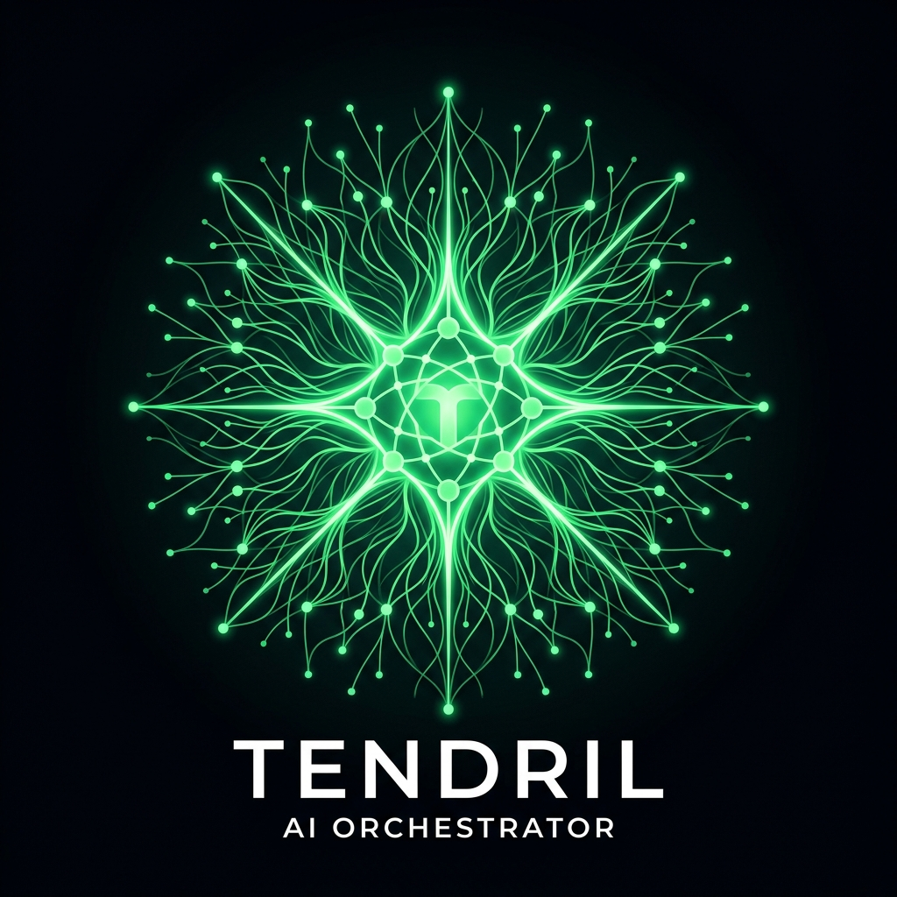

#  Tendril 🌱

**The agent that builds agents.**

Tendril is the **Root Agent**—the self-building orchestration layer that turns your frustrations into new skills via its `/edit` endpoint. It is not another chatbot. It is not another executor. It is an agentic kernel that fixes itself while it works.

*OpenClaw gave claws; Tendril grows them automatically.*

Download the MIT core, run locally in 47 seconds, or spin up a hosted container that literally improves itself from your logs.

<!-- TODO: Insert animated tendril growth GIF here -->

## Quick Start (Local Development)

```bash
# 1. Configure
cp .env.example .env
# Edit .env with your API keys (BYO keys or use our hosted credits at cloud.opentendril.com)
# At minimum: GROK_API_KEY and POSTGRES_PASSWORD

# 2. Create directories
mkdir -p data logs skills

# 3. Launch
docker compose up --build
```
Open **http://localhost:8080** → Chat UI with LLM provider selector.

## Production / VPS Deployment

If you want to host Tendril yourself on a cheap VPS (e.g. DigitalOcean, Hetzner):

```bash
# 1. Clone the repository
git clone https://github.com/dr3w/opentendril.git
cd opentendril

# 2. Configure environment
cp .env.example .env
# Edit .env with your keys and set TENDRIL_MODE=saas if monetizing

# 3. Launch in detached mode
docker compose up -d --build
```


## Features

- **Multi-LLM Routing** — Grok, Claude, OpenAI, or local models via vLLM. Pick the right model for each task.
- **Self-Building** — `/edit` endpoint lets Tendril modify its own source code through volume-mounted files.
- **Approval Gate** — Human-in-the-loop confirmation for destructive operations. Auto-approve in dev, require approval in production.
- **Signed Skills** — HMAC-SHA256 verified skill plugins. Tendril can build and sign new skills at runtime.
- **RAG Memory** — PGVector + HuggingFace embeddings for long-term memory and conversation recall.
- **Live Reload** — Edit `src/` files and changes apply instantly (no rebuild needed).
- **Enterprise Ready** — Rate limiting, non-root container, structured logging, secret management.

## API

| Method | Path | Description |
|--------|------|-------------|
| GET | `/` | Redirect to chat UI |
| GET | `/chat` | Chat interface |
| GET | `/health` | System health + loaded providers |
| POST | `/v1/chat` | JSON API for programmatic access |
| POST | `/edit` | Self-building: edit files via LLM |
| GET | `/approvals/pending` | View pending approval requests |
| POST | `/approvals/{id}/approve` | Approve a pending change |

## Architecture

```
┌────────────────────────────────────────┐
│              Chat UI / API              │
├────────────────────────────────────────┤
│            Orchestrator                 │
│  ┌─────────┐ ┌────────┐ ┌───────────┐ │
│  │   LLM   │ │  File  │ │ Approval  │ │
│  │  Router  │ │ Editor │ │   Gate    │ │
│  └─────────┘ └────────┘ └───────────┘ │
│  ┌─────────┐ ┌────────┐ ┌───────────┐ │
│  │ Memory  │ │ Skills │ │  Dreamer  │ │
│  │  (RAG)  │ │Manager │ │           │ │
│  └─────────┘ └────────┘ └───────────┘ │
├────────────────────────────────────────┤
│  Postgres (pgvector) │ Redis │ vLLM   │
└────────────────────────────────────────┘
```

## GPU Inference (Optional)

If you have an NVIDIA GPU, uncomment the `inference` service in `docker-compose.yml` to run local models via vLLM.

## License

MIT — Build freely. Scale with us.
